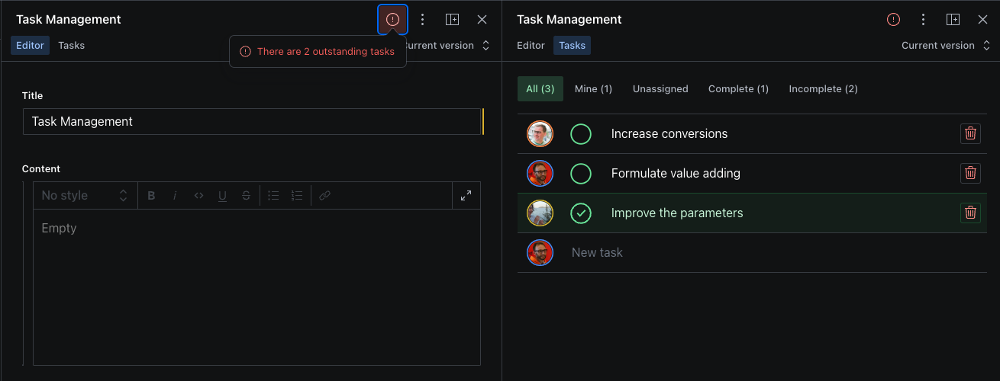

# sanity-plugin-tasks

Task assignment and management for Sanity documents.

Note: This is a Sanity Studio v3-exclusive plugin.



## Installation

```
npm install --save sanity-plugin-tasks
```

or

```
yarn add sanity-plugin-tasks
```

## Setup

Add it as a plugin in sanity.config.ts (or .js):

```ts
 import {createConfig} from 'sanity'
 import {tasks} from 'sanity-plugin-tasks'

 export const createConfig({
     // other config settings...
     plugins: [
         tasks()
     ]
 })
```

### View Pane

This will only register the `sanity.taskGroup` schema type which will store user-assigned tasks for individual documents. The other components you'll need to enqueue yourself.

In your Structure configuration, add the TaskView component as a View Pane. In the example below, we add it to any `article` type documents.

```ts
import {StructureResolver, DefaultDocumentNodeResolver} from 'sanity/desk'
import {TaskView} from 'sanity-plugin-tasks'

// ... all other settings
export const defaultDocumentNode: DefaultDocumentNodeResolver = (S, {schemaType}) => {
  switch (schemaType) {
    case `article`:
      return S.document().views([S.view.form(), S.view.component(TaskView).title('Tasks')])
    default:
      return S.document().views([S.view.form()])
  }
}
```

### Validation

Now you can see and create Tasks alongside documents. But to enforce completion before publishing, you'll need to import a Validation rule.

```ts
// ./schema/article.ts
import {defineType} from 'sanity'
import {documentValidation} from 'sanity-plugin-tasks'

export default defineType({
  name: 'article',
  title: 'Article',
  type: 'document',
  validation: () => [documentValidation],
  // ...all other settings
})
```

## License

MIT © Simeon Griggs
See LICENSE
